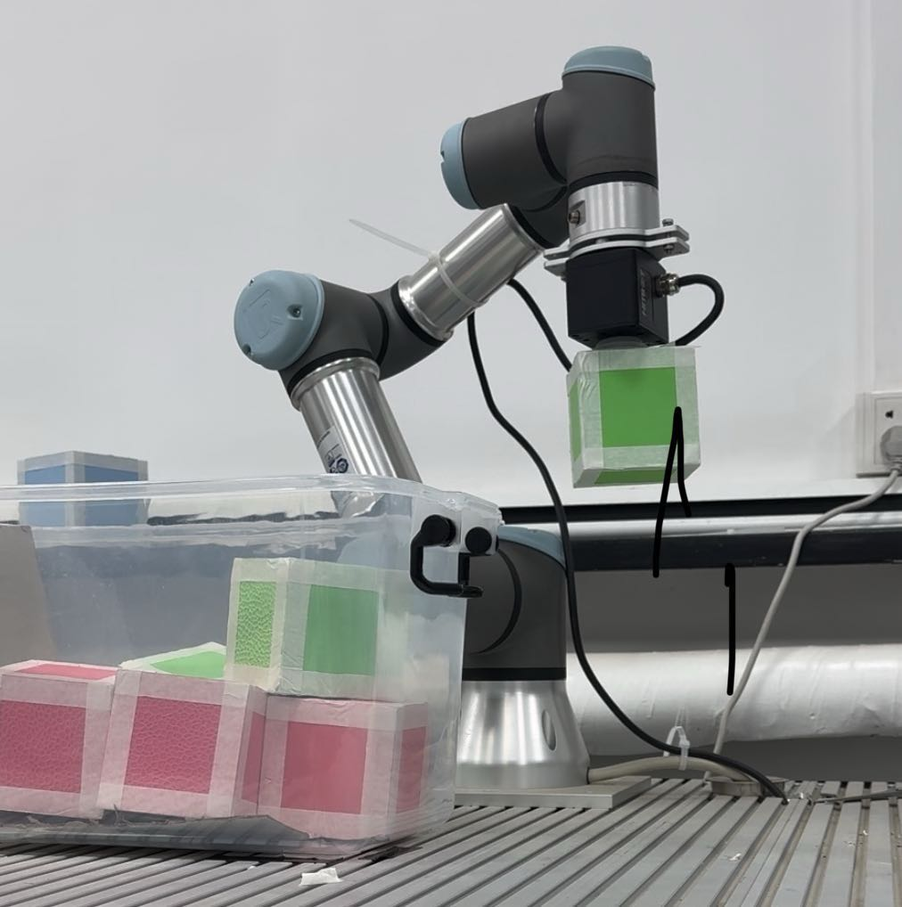
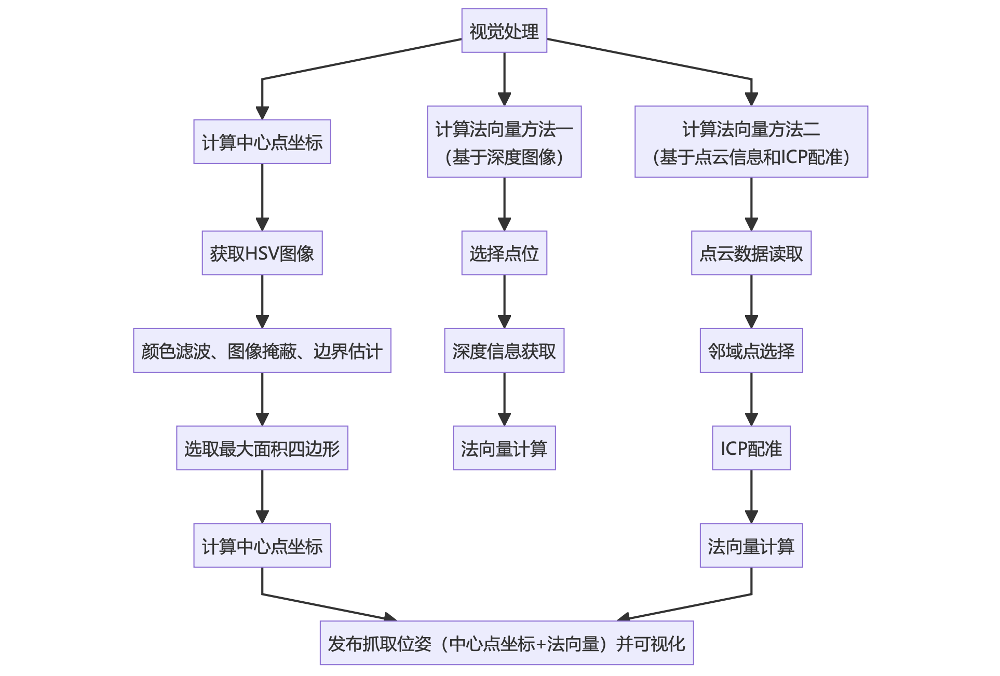
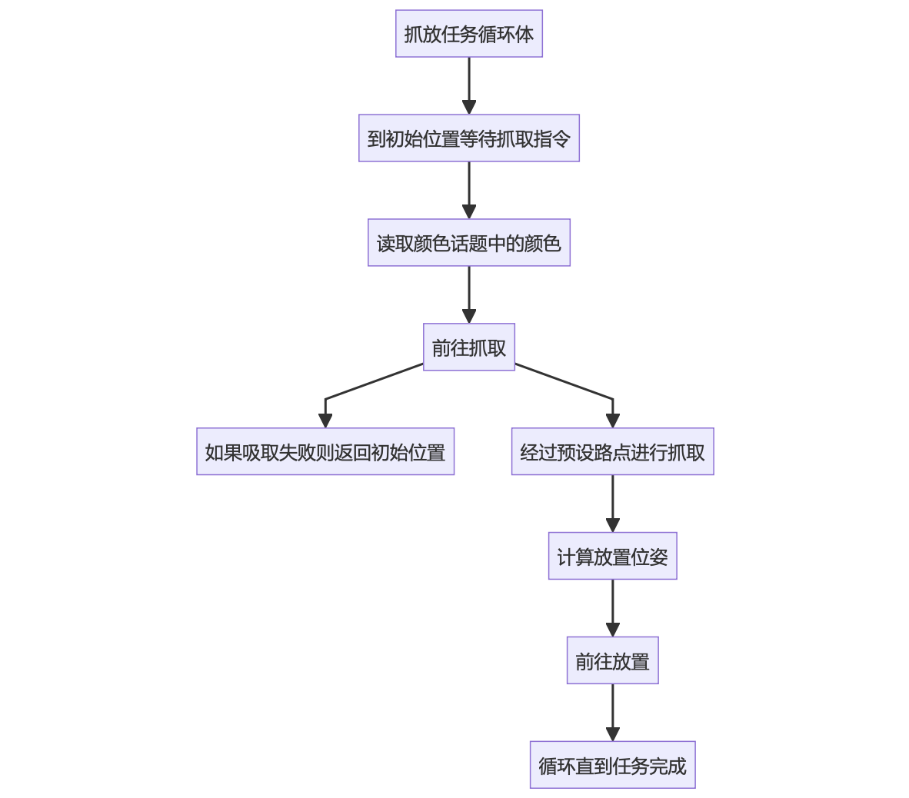
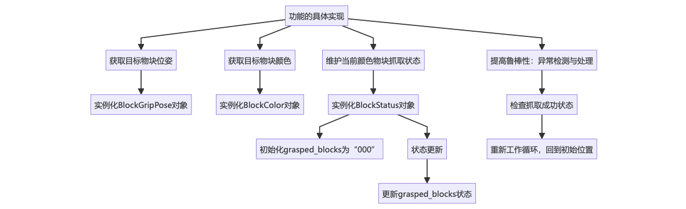

# Smart_Robot_Manipulation_2024

This repository contains core ideas, codes and some demos of the final project of Smart Robot Manipulation (2024 Spring), Tsinghua University. The main goal of this project is to implement a task using cameras and a robotic arm to autonomously grasp blocks and stack them according to their color classification.

Download the final demo video: [demo](https://cloud.tsinghua.edu.cn/f/9025689814b34d5a8fdc/?dl=1)

## Technological Difficulties

**Visual Recognition**: Use a Realsense camera, leveraging RGB, depth images, point clouds, and other information to estimate the horizontal plane center and the plane normal of the object.

**Path Planning**: How to plan the trajectory of the robotic arm so that it can perform the grasping action with the appropriate posture, avoiding obstacles and placing the object in the designated location.

**Grasp Detection**: How to detect whether the grasping operation was successful.

## Project Design

### Vision

The idea and framework of visual processing module:

To obtain the grasping point position, we used a method based on RGB images. The steps are as follows:

- Obtain an HSV image.
- Apply a filter to the target color in the HSV space and obtain the corresponding position mask.
- Remove extra areas, retaining only the image containing the graspable block.
- Estimate the image’s edges and use a polygon approximation to obtain all the quadrilaterals.
- Select the quadrilateral with the largest area, and use the vertex coordinates to estimate the center point.

To obtain the normal vector of the grasping surface, we initially used a method based on depth images, specifically:

- Select three non-collinear points near the center of the grasping surface and use external camera parameters and depth image information to calculate the 3D coordinates.
- Use the cross product to obtain the normal vector of the surface.

However, during actual testing, we found that the depth camera had a significant deviation. The depth estimation for the same point could vary by more than 1 cm when the system was stationary, which ultimately led to a drift in the estimation of the surface normal for inclined objects. Therefore, we adopted a method based on point cloud information for surface normal estimation. For the estimation, we mainly used the ICP alignment method as follows:

- Read point cloud data and construct a point cloud object.
- Query points near the grasping point and create a new point cloud object for neighborhood points.

By using the ICP alignment method, we aligned the neighborhood points with the ideal plane to obtain the rotation matrix and calculate the surface normal.

core codes: [vison module](./vision.ipynb)

### Path Planning & Control

The idea and framework of planning and control module:

And the detailed implementation of every part of functions:

To obtain the grasp position and color of the target object, this part of the information is published by the vision processing system after calculation. It requires subscription and reading, and the specific steps are as follows:

- Example: Subscribe to the BlockGripPose object to get the pose of the target object from the tf node.
- Example: Subscribe to the BlockColor object to get the color of the target object, with the topic named /block_color.

The current grasping status of each color block is maintained, and the specific steps are as follows:

- Example: Use the BlockStatus to track the status. Initially, grasped_blocks is set to "000", representing the number of green, red, and purple blocks grasped as 0, 0, 0.
- The status is updated, and after a block is grasped, grasped_blocks (corresponding color is encoded as 1) is updated. The system then calculates the placement position and continues the operation until all blocks are grasped and the grasped_blocks status is updated.

Based on the current task completion status and the color of the blocks, the system follows the pre-set route to complete the grasping and placement of the blocks. The specific steps are as follows:

- Return to the initial position and wait for the grasping command.
- Read the color of the block corresponding to the command, and then execute the grasping command.
- Move forward, then grasp at position 1, position 2, …, and so on.
- Calculate the placement position based on the color of the currently grasped block.
- Move to the placement position.
- Repeat the process until all tasks are completed.

Grasp failure detection: If an exception is detected, the system needs to handle it. To avoid block grasping failures and status updates, a function to check the success of grasping is added. The specific steps are as follows:

- Each time before grasping, check_grip_status() is called for inspection.
- If the grasping fails, the system re-executes the task, returning to the initial position.

After grasping and placing, since the task aims for objects in a relatively static environment and the objects in the environment do not significantly change positions, we used **hard-coded** pre-set points to record a few key positions. The robot avoids obstacles using these pre-set points when moving between locations. Due to the cluttered environment and many objects, it is possible for the arm to collide with obstacles or assistive devices, so we added an extra layer of spatial calculations to ensure smooth movement and route planning.

To detect whether the grasp is successful, we used information from the gripper sensor. If the grasp fails, the system immediately retries and starts a new round of grasping.

core codes: [plan & control module](./plan_control.ipynb)
